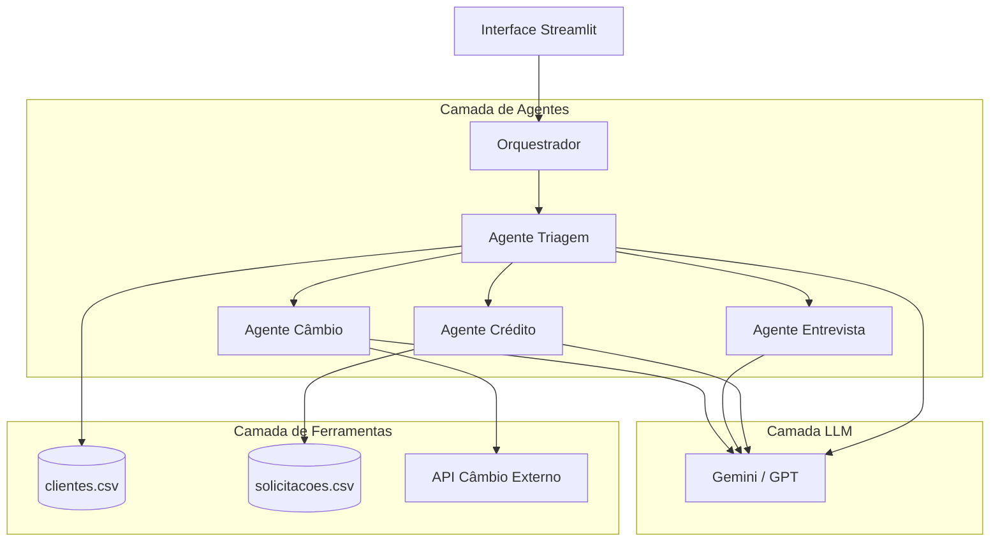
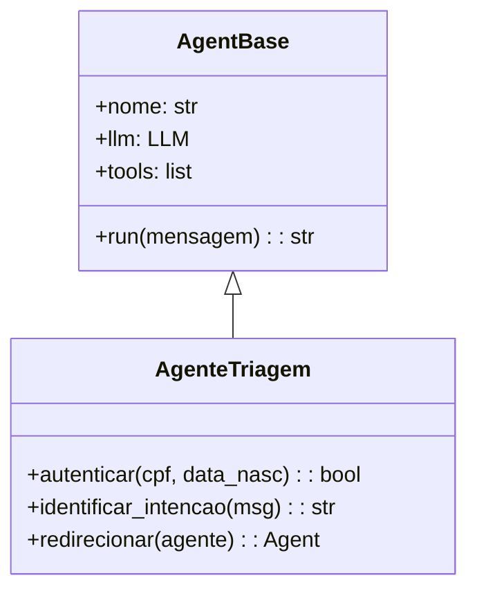
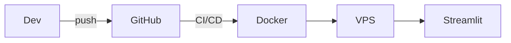

# Diagramas de Arquitetura

Gera diagramas Mermaid que documentam visualmente a arquitetura do sistema.

## Quando usar

- Início de um novo módulo ou feature
- Após definir componentes principais do sistema
- Para comunicar decisões arquiteturais ao time/avaliador
- Sempre que uma decisão impactar a estrutura geral

## Padrão de saída

Sempre salvar o diagrama em `docs/diagrams/` com nome descritivo, por exemplo:
- `docs/diagrams/arquitetura-geral.md`
- `docs/diagrams/fluxo-agentes.md`
- `docs/diagrams/modelo-dados.md`

## Templates por tipo

### Arquitetura Geral (graph TD)

### Diagrama de Classes / Módulos (classDiagram)

### Arquitetura de Infraestrutura

## Checklist antes de publicar diagrama

- [ ] Título claro e data no arquivo
- [ ] Legenda para siglas não óbvias
- [ ] Nível de detalhe adequado (nem muito simples, nem verboso demais)
- [ ] Reflete o estado **atual** do sistema (não o planejado)
- [ ] Referenciado em algum ADR ou doc de decisão

## Recursos adicionais

- Para tipos de diagrama avançados, ver [reference.md](reference.md)
