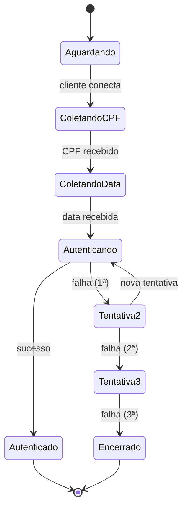
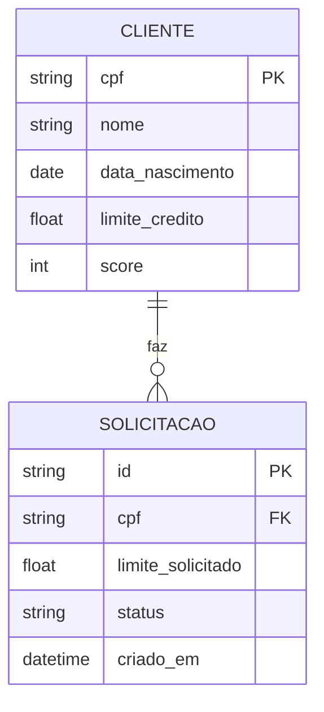

# Referência de Diagramas Mermaid

## Tipos disponíveis

| Tipo | Sintaxe | Uso |
|------|---------|-----|
| Fluxo | `graph TD` ou `graph LR` | Arquitetura geral, dependências |
| Sequência | `sequenceDiagram` | Interações entre agentes (ver system-flows) |
| Classes | `classDiagram` | Estrutura de código, herança |
| Estado | `stateDiagram-v2` | Máquinas de estado, ciclo de vida |
| ER | `erDiagram` | Modelo de dados |
| Gantt | `gantt` | Cronograma de entrega |

## Diagrama de Estado (exemplo para autenticação)

## Diagrama ER (exemplo para modelo de dados)

