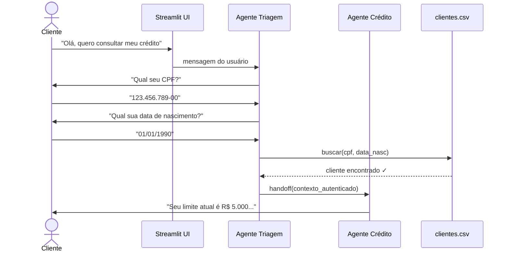
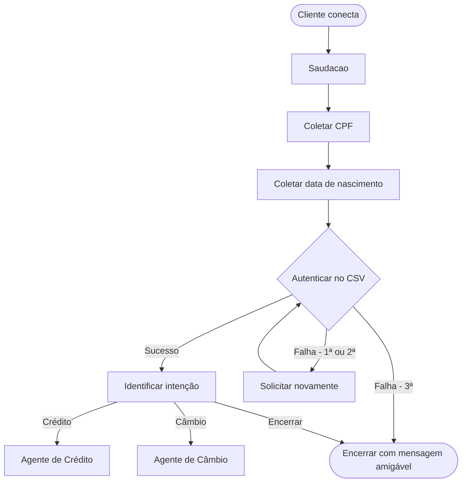
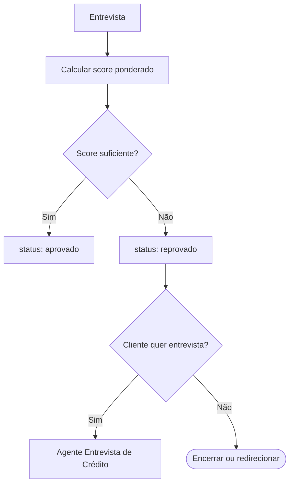

# Fluxos do Sistema

Documenta o comportamento dinâmico do sistema: quem chama quem, em que ordem, e o que acontece em cada caso.

## Quando usar

- Antes de implementar um agente (design-first)
- Para documentar um fluxo complexo recém-implementado
- Ao encontrar um bug: mapear o fluxo real vs esperado
- Para o README/documentação do case

## Padrão de saída

Salvar em `docs/flows/` com nome descritivo:
- `docs/flows/autenticacao.md`
- `docs/flows/solicitacao-credito.md`
- `docs/flows/handoff-agentes.md`

## Template: Sequência entre Agentes

## Template: Fluxo com Decisões (graph TD)

## Template: Fluxo de Decisão de Score

## Convenções de notação

| Símbolo | Significado |
|---------|-------------|
| `actor` | Usuário externo |
| `participant` | Componente do sistema |
| `-->>`  | Resposta / retorno assíncrono |
| `->>`   | Chamada / requisição |
| `Note over X` | Anotação de contexto |
| `alt / else` | Condicionais no sequenceDiagram |

## Checklist do fluxo

- [ ] Happy path documentado
- [ ] Edge cases mapeados (falha de auth, API fora, CSV corrompido)
- [ ] Responsabilidade de cada agente clara (sem overlap)
- [ ] Handoffs entre agentes explícitos
- [ ] Fluxo de encerramento coberto
