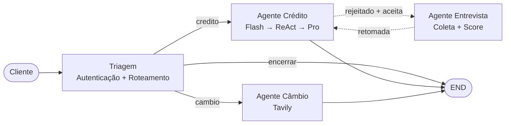

# Banco Ágil — Agente de Atendimento com IA

Assistente bancário digital multi-agente construído com **LangGraph**, **Gemini 2.5 (Flash + Pro)** e **React 18**, desenvolvido como desafio técnico para a posição de Desenvolvedor(a) de Agentes de IA.

---

## Visão geral

O sistema simula o atendimento digital de um banco moderno. Um cliente conversa com um assistente único via chat web; por trás, um grafo de agentes especializados colabora de forma transparente — o cliente nunca percebe as transições entre eles.

**Funcionalidades principais (cobertas pelo case):**

1. **Autenticação** do cliente via CPF + data de nascimento (máximo 3 tentativas).
2. **Consulta de limite** e score.
3. **Solicitação de aumento de limite** com registro em CSV, validação contra tabela de tetos por faixa de score, e oferta de entrevista em caso de rejeição.
4. **Entrevista de crédito** que coleta renda, tipo de emprego, dependentes e dívidas, recalcula o score de forma determinística e oferece a retomada do pedido.
5. **Cotação de câmbio em tempo real** via Tavily.
6. **Encerramento** limpo com mensagem de despedida.

**Fluxo de alto nível:**



> O cliente só fala com "o assistente" — a divisão em agentes é invisível.

---

## Arquitetura

```
┌────────────────────────────────────────────────────────────────┐
│  Frontend — React 18 + TypeScript + Vite + Tailwind            │
│  AuthCard (CPF+data) · ChatMessage · ContactCard                │
└──────────────────────────┬─────────────────────────────────────┘
                           │ HTTP (Vite proxy → :8000)
┌──────────────────────────▼─────────────────────────────────────┐
│  FastAPI Bridge  — api/main.py                                 │
│  POST /api/chat  ·  POST /api/feedback  ·  /api/debug/*         │
└──────────────────────────┬─────────────────────────────────────┘
                           │ graph.invoke(state, thread_id)
┌──────────────────────────▼─────────────────────────────────────┐
│  LangGraph  — src/graph.py                                     │
│  triagem → (credito | cambio | entrevista)                     │
│             ↓                                                  │
│  Router determinístico (campos de estado, sem LLM)             │
│             ↓                                                  │
│  registrar_turno → salvar_memoria → END                        │
└───────────┬────────────────┬────────────────────┬──────────────┘
            │                │                    │
   ┌────────▼─────┐ ┌────────▼─────┐    ┌────────▼────────────┐
   │ Redis        │ │ Qdrant       │    │ SQLite (dev)        │
   │ Checkpoints  │ │ Padrões      │    │ staging + runs +    │
   │ de estado    │ │ golden/worker│    │ judge_scores        │
   └──────────────┘ └──────────────┘    └─────────────────────┘
                            ▲
                            │ async
                    ┌───────┴────────┐
                    │ Worker Curador │  (python -m src.worker.curator)
                    │ Flash + Pro    │
                    └────────────────┘
```

### Camadas de persistência

| Camada | Tecnologia | Conteúdo | ADR |
|---|---|---|---|
| Estado da conversa | Redis (checkpointer LangGraph) | Mensagens + campos de estado por `thread_id` | ADR-004 |
| Memória de padrões | Qdrant (`learned_routing`, `learned_templates`) | Exemplos de roteamento e templates de resposta (sem PII) | ADR-023 |
| Lições ativas | SQLite (`curator_lessons`) | Regras abstratas derivadas de feedback | ADR-023 |
| Staging de curadoria | SQLite (`memory_staging`) | 1 registro por turno, `pending → approved/rejected` | ADR-023 |
| Observabilidade | SQLite (`agent_runs`, `tool_calls`) | 1 run por chamada `/api/chat` com duração e status | — |
| Qualidade | SQLite (`judge_scores`) | LLM-as-judge nightly | ADR-022 |
| Dados do cliente | CSV local (`data/clientes.csv`) | CPF, nome, data nasc., limite, score | — |
| Tabela de tetos | CSV local (`data/score_limite.csv`) | Faixas de score × limite máximo | ADR-024 |
| Solicitações | CSV local (`data/solicitacoes_aumento_limite.csv`) | Histórico de pedidos de aumento | — |

> **Importante (ADR-023):** não armazenamos dados do cliente em memória vetorial — CPF, nome e limite são volatéis e viveriam "congelados" no Qdrant. A memória aprendida contém **apenas padrões abstratos com placeholders**, nunca valores concretos do cliente.

---

## Agentes

| Agente | Arquivo | Responsabilidade | Modelos |
|--------|---------|------------------|---------|
| Triagem | `src/agents/triagem/` | Coleta CPF+data, autentica, classifica intenção, roteia | Flash |
| Crédito | `src/agents/credito/` | Consulta limite, processa aumento, orquestra 3 tools em loop ReAct | Flash + Pro |
| Entrevista | `src/agents/entrevista/` | Coleta 4 dados financeiros, calcula score, oferece retomada | Flash |
| Câmbio | `src/agents/cambio/` | Busca cotação em tempo real via Tavily, encerra perguntando se pode ajudar com mais algo | Flash |

Cada módulo segue a mesma estrutura (ADR-007):

```
src/agents/<agente>/
├── agent.py      # Nó do grafo + orquestração
├── contract.py   # Contratos anti-alucinação (ADR-014)
├── prompt.py     # System prompts como funções Python (ADR-018)
└── __init__.py
```

---

## Fluxos principais

Ver `docs/flows/` para diagramas completos. Abaixo o caso mais rico:

### Aumento de limite com entrevista

1. Cliente autenticado diz *"quero aumentar meu limite para R$ 10.000"*
2. Crédito chama `verificar_elegibilidade_aumento` → lê o score do CSV, consulta `score_limite.csv` para achar o teto da faixa, compara com valor pedido
3. **Se o valor ≤ teto**: chama `registrar_pedido_aumento(status=aprovado)` → `atualizar_limite_cliente` → apresenta aprovação com protocolo
4. **Se o valor > teto**: chama `registrar_pedido_aumento(status=rejeitado)`, guarda `pedido_pendente` no estado e oferece entrevista
5. Cliente aceita → `agente_ativo = entrevista` → 4 perguntas → `calcular_score_credito` → `atualizar_score` no CSV
6. Após cálculo, **entrevista compara o novo score com o pedido pendente + `score_limite.csv`** e dá um dos 3 desfechos:
   - **Viável**: *"seu novo score permite até R$ X — podemos seguir com R$ Y?"*
   - **Parcialmente viável**: ajusta `pedido_pendente` para o novo teto e oferece o valor possível
   - **Inviável**: informa honestamente que o score ainda não desbloqueia aumento
7. Cliente confirma → crédito retoma via `pedido_pendente` e fecha o ciclo

### Por que um **loop ReAct** no crédito

O Gemini chama uma tool por vez e espera o resultado antes de decidir a próxima. Sem o loop, só `verificar_elegibilidade` rodaria — `registrar_pedido` e `atualizar_limite` ficariam órfãos. Implementação em [`src/agents/credito/agent.py`](src/agents/credito/agent.py) (ver ADR-025).

---

## Decisões técnicas (ADRs)

Todos os ADRs estão em [`docs/decisions/`](docs/decisions/). Índice em [`docs/decisions/INDEX.md`](docs/decisions/INDEX.md).

**Fundação:**
- ADR-001 — LangGraph como framework
- ADR-002 — Gemini 2.5 Flash + Pro
- ADR-003 — Handoff implícito via `resposta_final`
- ADR-004 — Redis para estado
- ADR-005 — Score calculado em Python (nunca no LLM)
- ADR-006 — Tavily para câmbio
- ADR-007 — Estrutura modular por agente

**Qualidade e robustez:**
- ADR-009 — Classificador de intenção via LLM
- ADR-011 — Cache TTL no classificador
- ADR-012 — Fallback entre tiers de modelo
- ADR-013 — Pipeline Flash→Pro no crédito
- ADR-014 — Contratos de resposta (anti-alucinação)
- ADR-015 — Guardrails por criticidade
- ADR-016 — Normalização determinística de auth
- ADR-017 — Simulador automatizado de clientes
- ADR-018 — Prompts como código Python
- ADR-019 — Seções "Quando usar / Quando NÃO usar"
- ADR-025 — Loop ReAct + retry forçado para robustez de tool calling

**Memória e aprendizado:**
- ADR-021 — Few-shot dinâmico (atualizado para templates pelo ADR-023)
- ADR-022 — LLM-as-judge como sinal de qualidade
- ADR-023 — **Memória de padrões golden/worker (sem PII)**
- ADR-024 — Tabela `score_limite.csv` para tetos por faixa

**Experiência do usuário:**
- ADR-008 — Lead capture após 3 falhas de autenticação

---

## Estrutura do projeto

```
.
├── api/
│   └── main.py                   # FastAPI bridge + dashboard de curadoria
├── frontend/
│   └── src/app/                  # React 18 + Vite + Tailwind
├── src/
│   ├── agents/
│   │   ├── triagem/              # Autenticação + classificação
│   │   ├── credito/              # Flash + ReAct + Pro
│   │   ├── entrevista/           # Coleta + cálculo de score
│   │   └── cambio/               # Tavily + síntese
│   ├── tools/
│   │   ├── csv_repository.py     # buscar_cliente, atualizar_score,
│   │   │                         # atualizar_limite, registrar_solicitacao,
│   │   │                         # consultar_limite_maximo_por_score
│   │   ├── credit_tools.py       # verificar_elegibilidade_aumento,
│   │   │                         # registrar_pedido_aumento,
│   │   │                         # atualizar_limite_cliente
│   │   ├── score_calculator.py   # calcular_score_credito (determinístico)
│   │   ├── intent_classifier.py  # classificar_intencao (LLM + cache)
│   │   └── exchange_rate.py      # criar_tool_cambio (Tavily)
│   ├── infrastructure/
│   │   ├── model_provider.py     # invocar_com_fallback, tiers fast/pro
│   │   ├── response_contract.py  # Framework anti-alucinação (ADR-014)
│   │   ├── checkpointer.py       # RedisSaver do LangGraph
│   │   ├── vector_store.py       # Qdrant async + collections
│   │   ├── staging_store.py      # SQLite schema e migrations
│   │   ├── learned_memory.py     # Acesso unificado a padrões (ADR-023)
│   │   └── observability_store.py
│   ├── worker/
│   │   ├── curator.py            # python -m src.worker.curator [--once]
│   │   └── judge.py              # python -m src.worker.judge --sample 20
│   ├── models/state.py           # BancoAgilState (TypedDict)
│   ├── graph.py                  # StateGraph: nós, edges, router
│   └── config.py                 # Paths e variáveis de ambiente
├── data/
│   ├── clientes.csv
│   ├── score_limite.csv          # Faixas de score × limite máximo
│   └── solicitacoes_aumento_limite.csv
├── seeds/
│   └── patterns.json             # Golden set de padrões de memória
├── scripts/
│   ├── setup_qdrant.py           # Cria collections
│   ├── seed_patterns.py          # Popula golden set
│   └── reset_learning_data.py    # Limpa dados aprendidos (preserva golden)
├── simulador/
│   └── main.py                   # Suite automatizada de cenários
├── docs/
│   ├── decisions/                # ADRs
│   ├── diagrams/                 # Arquitetura e grafo
│   └── flows/                    # Fluxos de agentes
├── tests/                        # pytest
├── .env.example
└── requirements.txt
```

---

## Instalação e execução

### Pré-requisitos

- **Python 3.11+**
- **Node.js 20+** e **pnpm 9+** (para o frontend)
- **Redis** acessível (local ou túnel SSH)
- **Qdrant** acessível (local ou túnel SSH)
- Chaves de API: `GEMINI_API_KEY`, `TAVILY_API_KEY`

Para o tunneling:

```bash
ssh -i ~/.ssh/sua-chave.key \
  -L 6379:127.0.0.1:6379 \
  -L 6333:127.0.0.1:6333 \
  usuario@seu-servidor -N
```

### Backend

```bash
python -m venv .venv
.venv\Scripts\activate           # Windows (PowerShell)
# source .venv/bin/activate      # Linux/Mac
pip install -r requirements.txt

cp .env.example .env
# Preencha GEMINI_API_KEY, TAVILY_API_KEY e credenciais do Redis/Qdrant

# 1º setup — cria collections do Qdrant e popula o golden set
python scripts/setup_qdrant.py
python scripts/seed_patterns.py

# Sobe a API
uvicorn api.main:app --reload --port 8000
```

### Frontend

```bash
cd frontend
pnpm install
pnpm dev            # http://localhost:5173
```

### Worker curador (opcional em dev)

```bash
# Processa um batch e sai
python -m src.worker.curator --once

# LLM-as-judge — amostra 20 turnos aprovados e pontua qualidade
python -m src.worker.judge --sample 20
python -m src.worker.judge --stats
```

### Testes

```bash
pytest -q
python simulador/main.py --all            # suite de cenários end-to-end
```

### Deploy em VPS (Docker Compose self-contained)

A stack sobe em 5 containers isolados, orquestrados por `docker-compose.yml`:

| Container | Imagem | Função |
|---|---|---|
| `banco-agil-qdrant` | `qdrant/qdrant:latest` | Memória vetorial (ADR-023) |
| `banco-agil-redis` | `redis:7-alpine` | Estado de sessão (LangGraph checkpoint) |
| `banco-agil-backend` | build local (Python) | FastAPI + grafo de agentes |
| `banco-agil-frontend` | build local (nginx) | Frontend estático + proxy reverso `/api/*` |
| `banco-agil-worker` | build local (Python) | Curador; sob demanda via `profiles: [cron]` |

Subir:

```bash
# Uma única vez:
cp .env.example .env && nano .env       # preenche GEMINI_API_KEY, TAVILY_API_KEY, etc.
# Se a porta 80 já estiver em uso, ajuste HTTP_PORT no .env

docker compose up -d                    # sobe qdrant, redis, backend e frontend
docker compose exec backend python scripts/setup_qdrant.py
docker compose exec backend python scripts/seed_patterns.py

# Worker rodando sob demanda (via cron a cada 15min, por exemplo):
docker compose run --rm worker
```

Só a porta do `frontend/nginx` (`HTTP_PORT`, default 80) é exposta publicamente. Backend e Qdrant são expostos apenas em `127.0.0.1` para debug/demo via SSH tunnel. Redis fica totalmente privado.

Em VPS com 1-2GB de RAM: rode `sudo bash deploy/setup-swap.sh` antes do compose para criar 2GB de swap.

---

## Variáveis de ambiente

Ver `.env.example` para a lista completa. Principais:

| Variável | Descrição | Obrigatória |
|----------|-----------|-------------|
| `GEMINI_API_KEY` | Chave do Google AI Studio | sim |
| `GEMINI_MODEL` | Modelo Flash (default: `gemini-2.5-flash`) | não |
| `TAVILY_API_KEY` | Chave Tavily para câmbio | sim |
| `REDIS_HOST` / `REDIS_PORT` | Checkpoint do LangGraph | sim |
| `QDRANT_URL` | Base vetorial de padrões | sim |
| `GEMINI_API_KEY_EMBEDDINGS` | Chave separada para embeddings (opcional) | não |
| `GEMINI_API_KEY_CURATOR` | Chave separada para worker (opcional) | não |

---

## Dados de teste

O arquivo [`data/clientes.csv`](data/clientes.csv) contém cinco perfis cobrindo os cenários-chave:

| CPF | Nome | Data nasc. | Limite atual | Score | Cenário ilustrado |
|---|---|---|---|---|---|
| 123.456.789-00 | Ana Silva | 15/01/1990 | R$ 10.000 | 650 | Limite já no teto da faixa 500-699 → precisa entrevista para subir de faixa |
| 987.654.321-00 | Carlos Mendes | 22/07/1985 | R$ 3.000 | 320 | Pode aumentar até R$ 4.000 sem entrevista |
| 456.789.123-00 | Maria Oliveira | 10/03/1995 | R$ 8.000 | 780 | Pode aumentar até R$ 25.000 sem entrevista |
| 321.654.987-00 | João Santos | 30/11/1978 | R$ 4.000 | 440 | Já no teto 300-499, precisa entrevista |
| 789.123.456-00 | Fernanda Lima | 05/05/2000 | R$ 10.000 | 850 | Pode aumentar até R$ 50.000 sem entrevista |

### Tabela de tetos ([`data/score_limite.csv`](data/score_limite.csv))

| Faixa de score | Limite máximo permitido |
|---|---|
| 0 – 299 | R$ 2.000 |
| 300 – 499 | R$ 4.000 |
| 500 – 699 | R$ 10.000 |
| 700 – 849 | R$ 25.000 |
| 850 – 1000 | R$ 50.000 |

### Fórmula do score (ADR-005)

```
score = peso_renda + peso_emprego + peso_dependentes + peso_dividas

peso_renda       = min(renda / 1000 * 30, 900)
peso_emprego     = formal→300 | autônomo→200 | desempregado→0
peso_dependentes = 0→100 | 1→80 | 2→60 | 3+→30
peso_dividas     = sim→-100 | não→100
```

O cálculo é **100% Python** — o LLM só coleta os dados e chama a tool.

---

## Diferenciais implementados

| Tema | O que foi feito | ADR |
|---|---|---|
| **Anti-alucinação** | Contratos de resposta com retry + correção programática | ADR-014 |
| **Identidade única** | Filtro regex global contra "vou te transferir / especialista / outro setor" | ADR-003 |
| **Prompts como código** | `prompt.py` por agente com `build_system_prompt()`; sem arquivos `.md` soltos | ADR-018 |
| **Tool calling robusto** | Loop ReAct no crédito + retry forçado na entrevista para compensar Gemini pulando tools | ADR-025 |
| **Tabela de tetos** | `score_limite.csv` como fonte da verdade de eligibilidade — nenhuma regra hardcoded | ADR-024 |
| **Memória sem PII** | Qdrant guarda só padrões abstratos (roteamento + templates); CPF/nome/valores ficam fora | ADR-023 |
| **Golden + worker** | Curadoria manual inicial + worker assíncrono que destila lições de feedback negativo | ADR-023 |
| **Dashboard de observabilidade** | `/api/debug/curator/dashboard` com abas de staging, decisões, vectors, golden, métricas | ADR-023 |
| **LLM-as-judge** | Job noturno pontua qualidade em 3 dimensões; série temporal detecta regressão | ADR-022 |
| **AuthCard estruturado** | Input com máscaras de CPF e data, mais robusto que texto livre | — |
| **ContactCard** | Após 3 falhas de auth, chat bloqueia e exibe canais reais de atendimento | ADR-008 |
| **Simulador automatizado** | 20+ cenários (auth, câmbio, injection, PII) executáveis antes da entrega | ADR-017 |
| **Logs + métricas** | `/api/debug/logs` (tail) e `/api/debug/metrics` (p50/p95/p99, contadores) | — |

---

## Observabilidade

```
# Tail dos últimos logs
curl http://localhost:8000/api/debug/logs?n=100

# Métricas de latência e contadores
curl http://localhost:8000/api/debug/metrics | jq

# Dashboard HTML (abre no browser)
http://localhost:8000/api/debug/curator/dashboard
```

Log rotativo em `logs/banco_agil.log` (nível configurável via `.env`).

---

## Diagnóstico rápido

| Sintoma | Verificar |
|---|---|
| Chat trava após 1ª mensagem | Redis acessível? (`redis-cli -h $REDIS_HOST ping`) |
| Câmbio não retorna cotação | `TAVILY_API_KEY` válida? Tavily tem cota? |
| Aumento de limite não persiste no CSV | Logs do crédito — ver se as 3 tools foram chamadas no loop ReAct |
| Entrevista não atualiza score | Logs da entrevista — ver se `calcular_score_credito` foi chamada (retry forçado deveria garantir) |
| Dashboard sem dados | Rodou `seed_patterns.py` após o `setup_qdrant.py`? |

---

## Licença

Projeto acadêmico / desafio técnico — sem licença de uso comercial.
