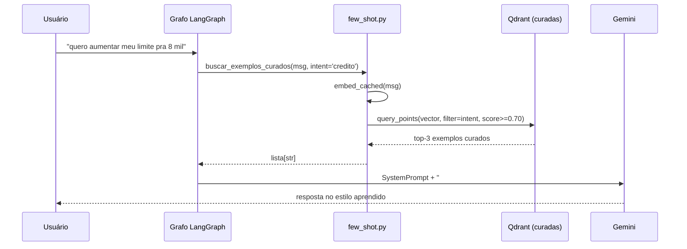

# ADR-021 — Few-Shot Dinâmico com Exemplos Curados

| Campo | Valor |
|---|---|
| **Status** | Aceito (atualizado em 2026-04-23 pelo ADR-023) |
| **Data** | 2026-04-23 |
| **Decisores** | Equipe de desenvolvimento |

> **Atualização (ADR-023):** a **ideia** de injetar exemplos semanticamente similares no prompt permanece, mas a **fonte** mudou. Antes eram pares pergunta+resposta curados (com PII e valores concretos) na collection `banco_agil_interacoes_curadas`. Agora são **templates com placeholders** (ex.: `"Olá, {nome}! Seu novo limite é R$ {novo_limite}"`) na collection `banco_agil_learned_templates`. O módulo `src/infrastructure/few_shot.py` manteve a API pública (`buscar_exemplos_curados`) como adaptador fino sobre `learned_memory.buscar_templates_formatados`.

---

## Contexto

Os prompts estáticos dos agentes de crédito ([src/agents/credito/prompt.py](../../src/agents/credito/prompt.py)) e câmbio ([src/agents/cambio/prompt.py](../../src/agents/cambio/prompt.py)) já seguem o padrão "When-NOT-to-use" do ADR-019. Mesmo assim, observamos classes de problema que prompt estático não resolve:

1. **Tom inconsistente**: o Flash às vezes responde curto demais ("OK, seu limite é X"), outras vezes prolixo demais. Não há uma calibração natural do que é "adequado" sem ver exemplos.
2. **Estrutura de resposta varia**: decisões de aumento de limite aparecem ora como lista, ora como parágrafo, ora com justificativa antes do número, ora depois. Sem padrão → difícil ler em série.
3. **Tratamento de casos raros**: cliente com score borderline (490-510), cliente pedindo valor absurdo (10x o limite atual) — casos com pouca frequência que o prompt estático não consegue cobrir explicitamente sem ficar ilegível.

Ao mesmo tempo, queríamos uma base de exemplos REAIS de respostas consideradas boas (originalmente turnos curados; com o ADR-023, passamos a usar templates com placeholders para evitar PII).

---

## Decisão

Adotar **few-shot dinâmico**: a cada turno, buscar 2-3 exemplos curados na collection `interacoes_curadas` filtrando por `intent` e ordenando por similaridade semântica com a mensagem atual, e injetar no system prompt antes de chamar o LLM.

### Fluxo



### Componentes implementados

- **[src/infrastructure/few_shot.py](../../src/infrastructure/few_shot.py)**
  - `buscar_exemplos_curados(msg, intent, top_k=3)` — interface síncrona
  - Cache LRU de embeddings (`_embed_cached`) — evita re-embed na mesma mensagem
  - `score_threshold` alto (0.70) — melhor 0 exemplos que 2 ruins
  - Falha silenciosa → retorna `[]` (few-shot é OPCIONAL)

- **Injeção nos prompts**
  - [src/agents/credito/prompt.py](../../src/agents/credito/prompt.py): `build_flash_prompt` e `build_pro_prompt` aceitam `exemplos_curados`
  - [src/agents/cambio/prompt.py](../../src/agents/cambio/prompt.py): `build_system_prompt` idem
  - Formatter `formatar_exemplos_para_prompt()` produz bloco padronizado
  - Agente chama `buscar_exemplos_curados(ultima_msg, intent=...)` antes de invocar o LLM

### Bloco adicionado ao prompt

```
## Exemplos curados de interações anteriores de sucesso
Use estes exemplos como referência de TOM, ESTRUTURA e PROFUNDIDADE.
NÃO copie valores — use os dados do cliente autenticado acima.

### Exemplo 1
[conteúdo do turno curado]

### Exemplo 2
...
```

---

## Justificativa

### Por que poucos exemplos (3) e não muitos (10+)?
- Context window é caro (tokens) e sujeito a "lost in the middle".
- 3 exemplos relevantes > 10 exemplos diluídos.
- Benchmark informal no MS_GeoMap: saturação de ganho em torno de 3-4 exemplos.

### Por que threshold alto (0.70)?
Exemplo distante só adiciona ruído. Se não há bom exemplo, melhor deixar o prompt base falar sozinho. O threshold faz a saída degradar graciosamente quando a collection está pequena.

### Por que cache LRU nos embeddings?
Usuários frequentemente repetem/reformulam a pergunta em turnos próximos. O cache por string pura elimina re-embed nos casos triviais sem precisar invalidar.

### Por que filtrar por `intent`?
Evita que um exemplo de câmbio apareça no prompt de crédito. O filtro é um HINT de relevância — a similaridade semântica já ajudaria, mas o filtro explícito é determinístico e previsível.

### Por que injetar o texto integral e não um resumo?
Porque o valor do few-shot está no STILE — frases, ritmo, estrutura de argumento. Resumir perde exatamente isso.

### Por que NÃO copiar valores numéricos dos exemplos?
Risco de alucinação: LLM pode ver "R$ 5.000" em exemplo e repetir na resposta. Mitigação tripla:
1. Instrução explícita no cabeçalho do bloco: "NÃO copie valores"
2. ADR-014 continua ativo: contratos de resposta validam valores do cliente real
3. Exemplos curados vêm do worker, que já rejeita respostas com alucinação

---

## Alternativas consideradas

### Manter apenas memória por CPF (status quo)
- **Vantagem:** zero complexidade adicional.
- **Desvantagem:** histórico de um cliente raramente ajuda em perguntas novas. Primeiros turnos de clientes novos ficam sem ajuda.

### Few-shot estático embutido no prompt
- **Vantagem:** determinístico, fácil de versionar.
- **Desvantagem:** não melhora com o tempo, humano precisa escolher exemplos manualmente, e os exemplos "envelhecem" (decisões reais mudam com política de crédito).

### Fine-tuning do modelo
- **Vantagem:** tom e estilo ficam internalizados, sem custo de prompt por turno.
- **Desvantagem:** custo alto, lock-in no provedor, ciclo longo. Few-shot cobre 80% do valor com 5% do esforço.

### Retrieval-Augmented Generation (RAG) tradicional com documentos
- **Vantagem:** padrão da indústria.
- **Desvantagem:** a base de conhecimento aqui NÃO são documentos — são interações. RAG clássico exigiria converter turnos em "documentos" artificiais, perdendo a natureza dialógica.

---

## Roadmap (não implementado na Fase 3 inicial)

1. **Re-ranking**: depois do top-k do Qdrant, re-ranquear com um cross-encoder leve. Melhora precisão quando a collection passar de alguns milhares de exemplos.
2. **Decaimento temporal**: dar menos peso a exemplos antigos (ex: idade > 90 dias × 0.7). Respostas de políticas antigas NÃO devem reforçar o modelo.
3. **Diversidade**: após top-k, podar exemplos muito similares entre si (MMR) para maximizar variedade de estilos.
4. **A/B test formal**: comparar respostas com e sem few-shot em conjuntos de teste do simulador (ver ADR-017) para medir o lift real em qualidade.

---

## Consequências

**Positivas:**
- Tom e estrutura melhoram à medida que a base curada cresce, SEM fine-tuning.
- Exemplos ruins nunca entram (já filtrados pelo worker + threshold de score).
- Frontend/simulador não precisa mudar: é transparente para o caller.
- Falha gracioso: se o Qdrant está down ou a collection está vazia, o agente funciona normalmente.

**Negativas / trade-offs:**
- Latência: +30-50ms por turno (embed + query Qdrant). Mitigado pelo cache.
- Tokens: +500-1500 tokens por turno (3 exemplos). Aumenta custo linear.
- Dependência de qualidade do curador: few-shot amplifica decisões do worker, boas OU ruins.
- Risco baixo mas real de "copy-paste" de valor alucinado — mitigado por ADR-014.

---

## Referências

- ADR-013: Pipeline Flash → Pro
- ADR-014: Contratos de resposta (anti-alucinação)
- ADR-019: Estrutura de prompts "Quando NÃO usar"
- ADR-023: Memória de padrões golden (fonte atual dos exemplos)
- [src/infrastructure/few_shot.py](../../src/infrastructure/few_shot.py)
- Artigo: _"In-Context Learning as Implicit Bayesian Inference"_ (Xie et al.)
