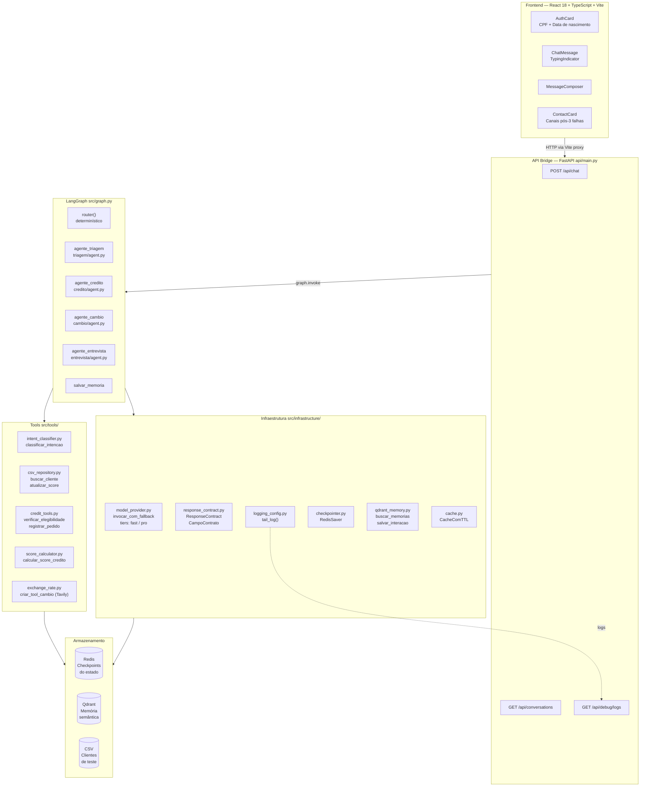
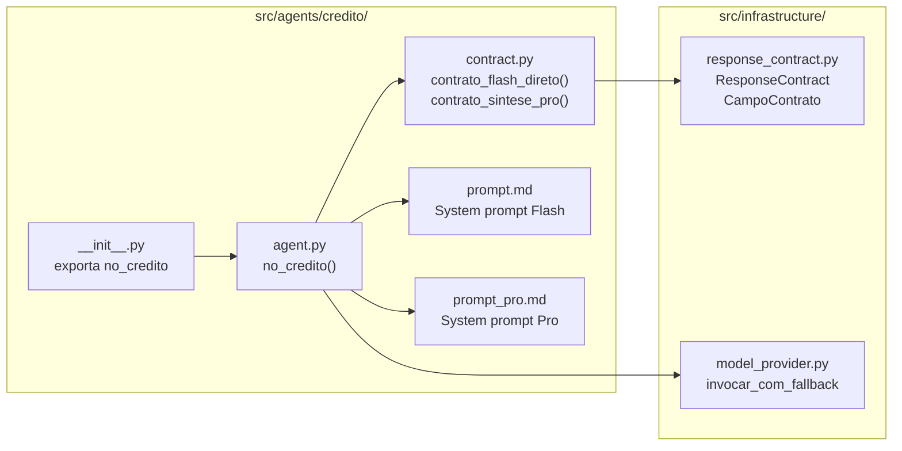
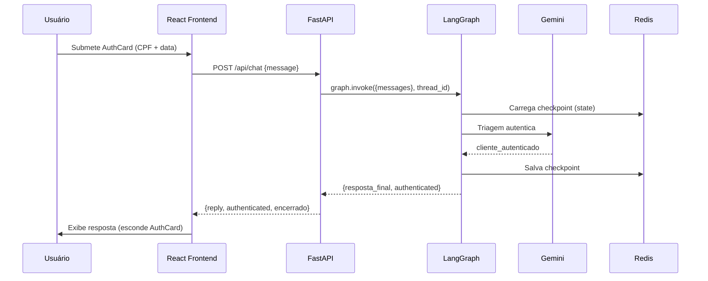

# Diagrama de Arquitetura Geral — Banco Ágil

## Visão de Camadas

---

## Visão de Componentes por Agente

Cada agente é um módulo Python auto-contido:

---

## Fluxo de uma requisição

---

## Princípios arquiteturais

| Princípio | Implementação |
|---|---|
| **Identidade única** | Nenhum agente menciona transferências; filtro `_RE_HANDOFF` em todos |
| **Contrato explícito** | `resposta_final` sinaliza fim de turno; `contract.py` valida conteúdo |
| **Resiliência em camadas** | try/except em cada LLM call → fallback → correção programática |
| **Observabilidade** | Logging estruturado + `/api/debug/logs` + warnings de contrato |
| **Co-localização** | Código + prompt + contrato no mesmo módulo por agente |
| **Sem cálculos no LLM** | Score calculado em Python puro; valores injetados via contexto estruturado |
