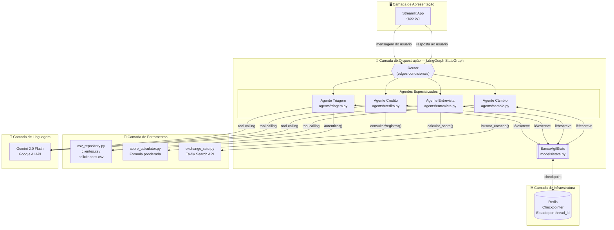
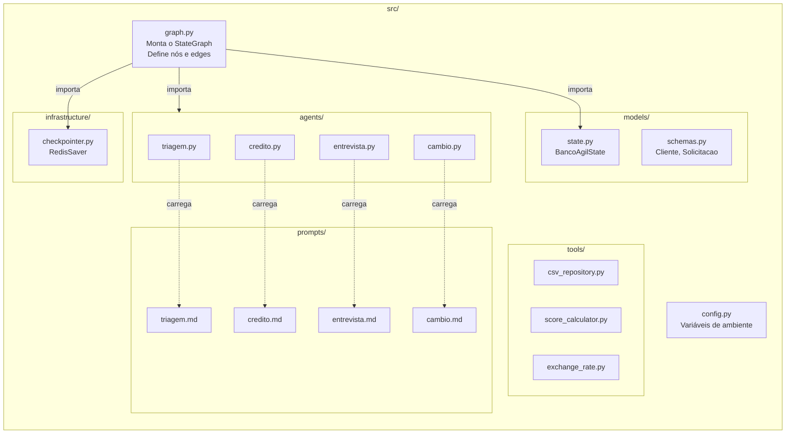

# Diagrama: Arquitetura Geral do Sistema

**Data:** 2026-04-22  
**Versão:** 1.0  
**Referências:** [ADR-001](../decisions/ADR-001-framework-agentes.md) · [ADR-003](../decisions/ADR-003-handoff-agentes.md) · [ADR-004](../decisions/ADR-004-persistencia-estado.md)

---

## Visão de Camadas

---

## Visão de Componentes (mais detalhada)

---

## Princípios arquiteturais ilustrados

| Camada | Responsabilidade única |
|--------|----------------------|
| `agents/` | Lógica conversacional e chamadas LLM |
| `prompts/` | Comportamento e persona do agente |
| `tools/` | Operações determinísticas (I/O, cálculos) |
| `models/` | Contratos de dados (state, schemas) |
| `infrastructure/` | Setup de serviços externos (Redis) |
| `graph.py` | Topologia do sistema (quem chama quem) |
