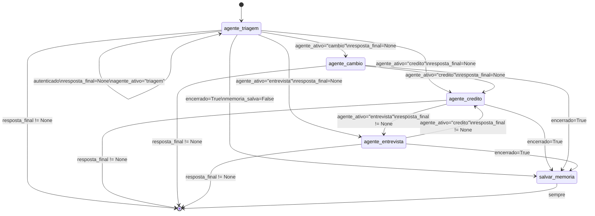
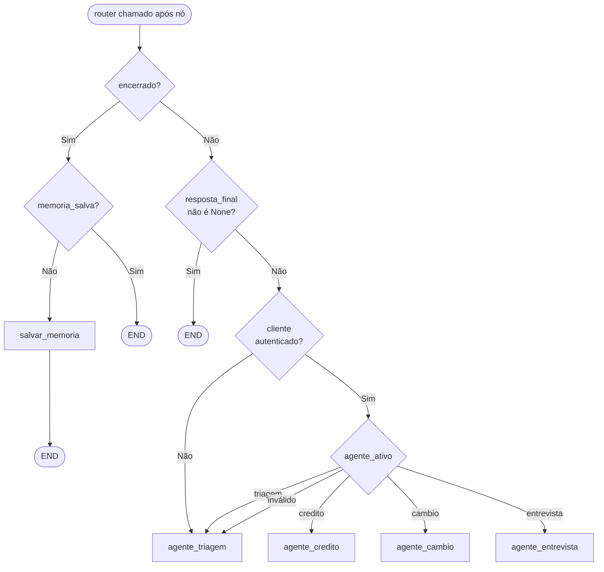
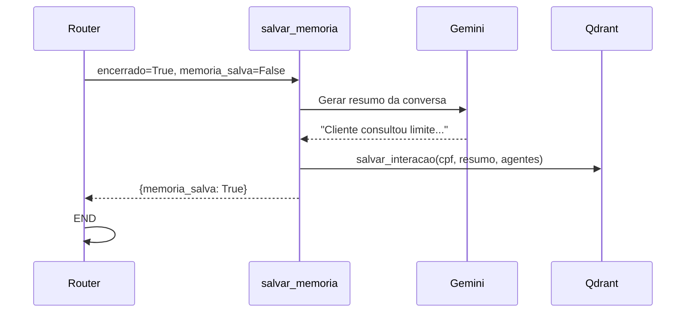

# Diagrama do Grafo LangGraph — Banco Ágil

## Topologia completa



---

## Lógica do Router



---

## Código de referência (`src/graph.py`)

```python
def router(state: BancoAgilState) -> str:
    # Encerramento: salva memória semântica antes de terminar
    if state.get("encerrado"):
        if not state.get("memoria_salva"):
            return "salvar_memoria"
        return END

    # Agente sinalizou resposta final → fim do turno
    if state.get("resposta_final") is not None:
        return END

    # Turno em andamento → rotear para o agente correto
    if not state.get("cliente_autenticado"):
        return "agente_triagem"

    agente = state.get("agente_ativo", "triagem")
    destino = f"agente_{agente}"

    mapa_valido = {"agente_triagem", "agente_credito", "agente_entrevista", "agente_cambio"}
    if destino not in mapa_valido:
        logger.warning("agente_ativo inválido '%s', retornando triagem", agente)
        return "agente_triagem"

    return destino
```

```python
# Montagem do grafo
workflow = StateGraph(BancoAgilState)

workflow.add_node("agente_triagem",    no_triagem)
workflow.add_node("agente_credito",    no_credito)
workflow.add_node("agente_entrevista", no_entrevista)
workflow.add_node("agente_cambio",     no_cambio)
workflow.add_node("salvar_memoria",    no_salvar_memoria)

workflow.set_entry_point("agente_triagem")

for agente in ["agente_triagem", "agente_credito", "agente_entrevista", "agente_cambio"]:
    workflow.add_conditional_edges(agente, router)

workflow.add_edge("salvar_memoria", END)   # sempre termina após salvar

checkpointer = criar_checkpointer()        # RedisSaver
graph = workflow.compile(checkpointer=checkpointer)
```

---

## Por que o router não usa LLM

O router é chamado **após cada nó**, potencialmente várias vezes por turno. Usar um LLM ali adicionaria:

- **Latência**: 300–800 ms por chamada adicional ao Gemini
- **Custo**: chamadas extras sem valor de negócio
- **Não-determinismo**: risco de loops ou destinos inesperados

A lógica é 100% baseada em campos de estado (`resposta_final`, `encerrado`, `agente_ativo`, `cliente_autenticado`), tornando-a:

- ✅ Previsível e auditável
- ✅ Testável unitariamente sem mocks de LLM
- ✅ Com tempo de execução constante (~1 ms)

O único uso de LLM no roteamento é o **classificador de intenção** (`intent_classifier.py`), que é chamado **dentro** dos agentes de triagem, não no router. Ele tem cache TTL de 5 min para mensagens repetidas (ADR-011).

---

## Nó `salvar_memoria`

Executado **uma vez** ao final de cada sessão (`encerrado=True`):

1. Gera um resumo da conversa via LLM (prompt interno ao nó)
2. Persiste no Qdrant com filtro por CPF
3. Seta `memoria_salva=True` para evitar execução dupla


