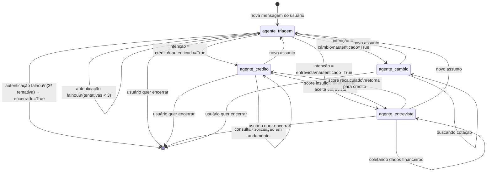
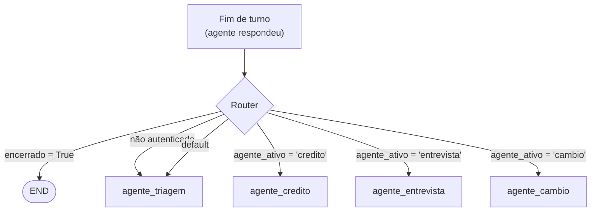

# Diagrama: Grafo de Estados LangGraph

**Data:** 2026-04-22  
**Versão:** 1.0  
**Referências:** [ADR-001](../decisions/ADR-001-framework-agentes.md) · [ADR-003](../decisions/ADR-003-handoff-agentes.md)

---

## Topologia do StateGraph

Este diagrama representa exatamente os nós (`add_node`) e arestas (`add_edge` / `add_conditional_edges`) do `StateGraph` implementado em `graph.py`.



---

## Função Router (edges condicionais)

O roteamento é feito por uma função Python pura — não por LLM:



---

## Código de referência — `graph.py`

```python
from langgraph.graph import StateGraph, END
from src.models.state import BancoAgilState

def criar_grafo(checkpointer):
    workflow = StateGraph(BancoAgilState)

    # Nós
    workflow.add_node("agente_triagem",    no_triagem)
    workflow.add_node("agente_credito",    no_credito)
    workflow.add_node("agente_entrevista", no_entrevista)
    workflow.add_node("agente_cambio",     no_cambio)

    # Ponto de entrada
    workflow.set_entry_point("agente_triagem")

    # Edges condicionais — saem de cada agente
    for agente in ["agente_triagem", "agente_credito", "agente_entrevista", "agente_cambio"]:
        workflow.add_conditional_edges(agente, router)

    return workflow.compile(checkpointer=checkpointer)


def router(state: BancoAgilState) -> str:
    if state["encerrado"]:
        return END
    if not state.get("cliente_autenticado"):
        return "agente_triagem"
    return f"agente_{state['agente_ativo']}"
```

---

## Por que o router não usa LLM?

O roteamento é **determinístico** — baseado em campos do estado, não em interpretação de texto:

- `encerrado` → flag booleana setada por qualquer agente quando o usuário pede fim
- `cliente_autenticado` → dict preenchido pelo Agente de Triagem após auth bem-sucedida
- `agente_ativo` → string setada pelo Agente de Triagem ao identificar a intenção

Isso garante **previsibilidade, rastreabilidade e performance** — não há chamada LLM extra para decidir o próximo passo.
