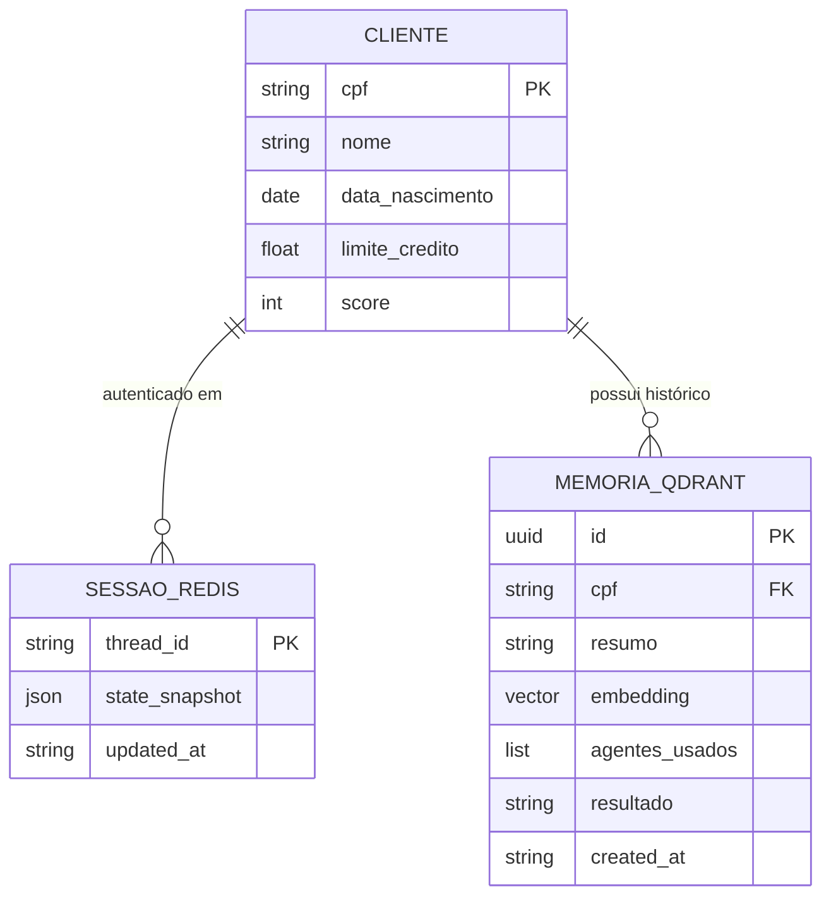
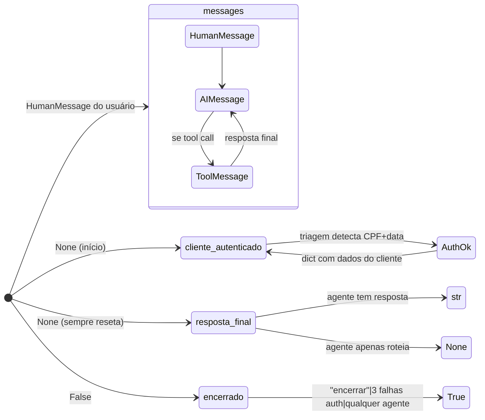
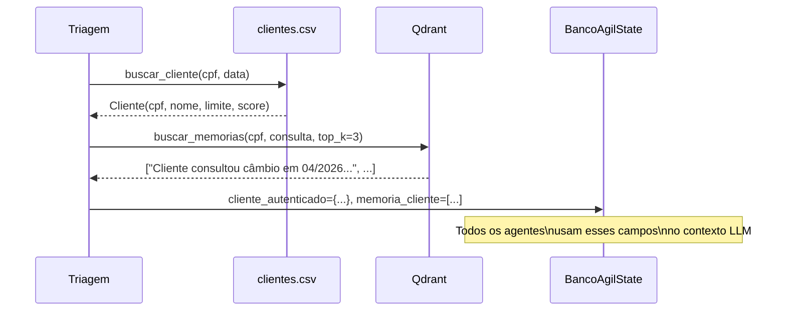
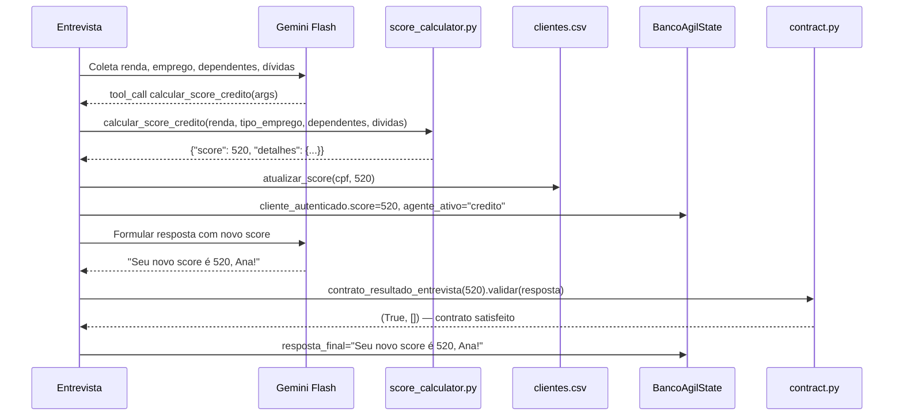

# Modelo de Dados — Banco Ágil

## Entidades do sistema



---

## `BancoAgilState` — Estado compartilhado LangGraph

Definido em `src/models/state.py`. Cada turno carrega e persiste este objeto via Redis.

```python
class BancoAgilState(TypedDict):

    messages: Annotated[list[BaseMessage], add_messages]
    # Reducer: add_messages (acumula, não substitui)
    # Contém: HumanMessage, AIMessage, ToolMessage

    cliente_autenticado: Optional[dict]
    # None até autenticação bem-sucedida.
    # Após: {"cpf": str, "nome": str, "limite_credito": float, "score": int,
    #         "data_nascimento": str}

    agente_ativo: str
    # "triagem" | "credito" | "entrevista" | "cambio"
    # Determina o destino do router quando resposta_final=None

    tentativas_auth: int
    # Conta falhas de autenticação consecutivas.
    # Ao atingir MAX_TENTATIVAS_AUTH (3): encerrado=True

    encerrado: bool
    # True → router vai para salvar_memoria → END
    # Qualquer agente pode setar este campo

    memoria_cliente: Optional[list]
    # Resumos semânticos das sessões anteriores deste CPF (via Qdrant)
    # Preenchido na autenticação; injetado no contexto dos agentes

    memoria_salva: bool
    # True após salvar_memoria ter executado com sucesso
    # Evita dupla gravação ao Qdrant

    resposta_final: Optional[str]
    # Contrato de saída dos agentes:
    #   str  → agente tem resposta → router vai para END
    #   None → agente apenas roteou → router continua avaliando
    # A API lê este campo diretamente (sem parsear messages)
```

### Ciclo de vida por campo



---

## Tabela CSV de Clientes

Localização: `data/clientes.csv`

```
cpf,nome,data_nascimento,limite_credito,score
123.456.789-00,Ana Silva,1990-01-15,5000.00,650
987.654.321-00,Carlos Mendes,1985-07-22,3000.00,320
456.789.123-00,Maria Oliveira,1995-03-10,8000.00,780
321.654.987-00,João Santos,1978-11-30,1500.00,180
789.123.456-00,Fernanda Lima,2000-05-05,10000.00,850
```

Acesso via `src/tools/csv_repository.py`:
- `buscar_cliente(cpf, data_nascimento)` — autenticação
- `atualizar_score(cpf, novo_score)` — após entrevista financeira

---

## Fluxo de dados: autenticação e enriquecimento



---

## Fluxo de dados: entrevista e atualização de score


