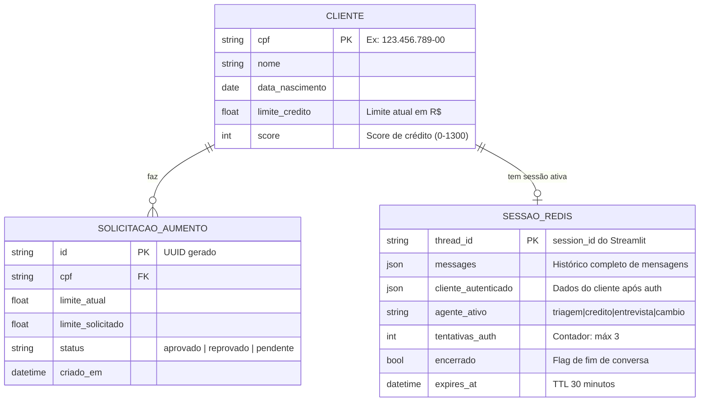
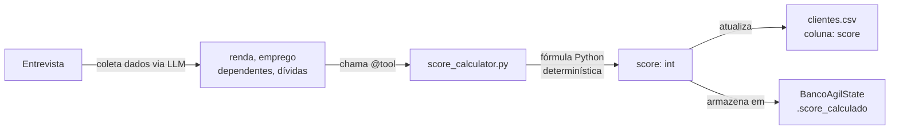

# Diagrama: Modelo de Dados

**Data:** 2026-04-22  
**Versão:** 1.0  
**Referências:** [ADR-005](../decisions/ADR-005-calculo-score.md) · [ADR-007](../decisions/ADR-007-estrutura-codigo.md)

---

## Entidades e Relacionamentos



---

## Estrutura dos CSVs

### `clientes.csv`

| Campo | Tipo | Exemplo | Observação |
|-------|------|---------|------------|
| `cpf` | string | `123.456.789-00` | Chave primária, com máscara |
| `nome` | string | `João Silva` | Nome completo |
| `data_nascimento` | date | `1990-01-15` | Formato ISO: YYYY-MM-DD |
| `limite_credito` | float | `5000.00` | Limite atual em R$ |
| `score` | int | `650` | Score atual (0–1300) |

### `solicitacoes_aumento_limite.csv`

| Campo | Tipo | Exemplo | Observação |
|-------|------|---------|------------|
| `id` | string | `uuid4` | Gerado automaticamente |
| `cpf` | string | `123.456.789-00` | FK para clientes.csv |
| `limite_atual` | float | `5000.00` | Limite no momento da solicitação |
| `limite_solicitado` | float | `10000.00` | Novo limite pedido |
| `status` | string | `aprovado` | aprovado \| reprovado \| pendente |
| `criado_em` | datetime | `2026-04-22T10:30:00` | Timestamp ISO 8601 |

---

## Estado da Conversa — `BancoAgilState`

Estrutura TypedDict que trafega pelo grafo LangGraph (ver [ADR-003](../decisions/ADR-003-handoff-agentes.md)):

```python
class BancoAgilState(TypedDict):
    messages: Annotated[list[BaseMessage], add_messages]
    cliente_autenticado: Optional[dict]   # None até autenticar
    agente_ativo: str                     # "triagem" | "credito" | "entrevista" | "cambio"
    tentativas_auth: int                  # 0, 1, 2 — encerra na 3ª falha
    encerrado: bool                       # True = encerra o loop
```

---

## Fluxo de dados (score)


