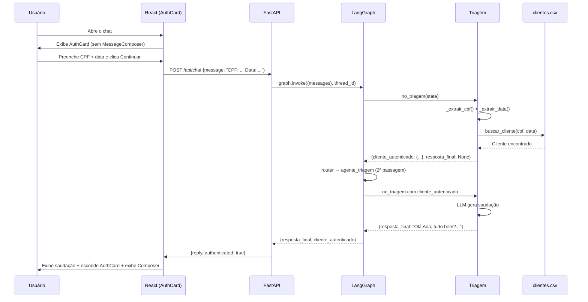

# Fluxo de Autenticação — Banco Ágil

## Visão do cliente

O cliente abre o chat e vê imediatamente o `AuthCard` — um campo estruturado com máscara de CPF e data de nascimento — antes de poder digitar qualquer mensagem.

```
┌──────────────────────────────────────────┐
│  IDENTIFICAÇÃO DO CLIENTE                │
│                                          │
│  ☐ CPF                                   │
│  [___ . ___ . ___-__]                    │
│                                          │
│  🗓 Data de nascimento                   │
│  [__/__/____]                            │
│                                          │
│         [ Continuar ]                    │
└──────────────────────────────────────────┘
```

Após a autenticação bem-sucedida, o `AuthCard` desaparece e o chat é liberado.

---

## Sequência completa



---

## Fluxo de decisão (Triagem)

```mermaid
flowchart TD
    START([Mensagem recebida]) --> A{cliente\nautenticado?}

    A -- Sim --> B{agente_ativo?}
    B -- triagem --> C[Identificar intenção]
    B -- outro --> D[Passthrough silencioso]
    C --> END1([Rotear ou responder])
    D --> END1

    A -- Não --> E[Extrair CPF + data do histórico]
    E --> F{Ambos\nencontrados?}

    F -- Não --> G[LLM conduz coleta]
    G --> END2([resposta_final = texto])

    F -- Sim --> H[buscar_cliente(cpf, data)]
    H --> I{Cliente\nencontrado?}

    I -- Sim --> J[Autenticação OK\nbuscar_memorias Qdrant]
    J --> K[resposta_final = None\nrouter volta à triagem]
    K --> L[LLM gera saudação com nome]
    L --> END3([resposta_final = saudação])

    I -- Não --> M[tentativas++]
    M --> N{tentativas\n>= 3?}
    N -- Não --> O[LLM informa erro\npede nova tentativa]
    O --> P[resposta_final = mensagem de erro\nAuthCard reexibido no frontend]
    N -- Sim --> Q[encerrado = True\nresposta_final = mensagem final]
    Q --> R[Frontend: ContactCard\nComposer oculto]
```

---

## Comportamento do frontend por estado

| Estado do backend | `authenticated` | `encerrado` | Comportamento no frontend |
|---|---|---|---|
| Aguardando dados | `false` | `false` | AuthCard exibido (sem retry) |
| Falha na autenticação (1ª ou 2ª) | `false` | `false` | AuthCard reexibido com `retry=true` |
| Falha na autenticação (3ª) | `false` | `true` | ContactCard exibido; Composer oculto |
| Autenticação bem-sucedida | `true` | `false` | AuthCard oculto; Composer exibido |

---

## Edge cases

| Cenário | Tratamento |
|---|---|
| CPF inválido (formato) | Validação no AuthCard (JavaScript, antes de enviar) |
| Data de nascimento futura | Validação no AuthCard |
| CPF não encontrado no CSV | Mensagem de erro + AuthCard reexibido |
| Data correta mas CPF errado | Idem |
| Tentativa 3 falha | `encerrado=True`; ContactCard com WhatsApp, 0800, site, SAC |
| Recarregamento da página | Estado perdido no frontend; Redis mantém o histórico |
| Sessão nova via sidebar | `isAuthenticated` e `isEncerrado` resetados para `false` |

---

## Componentes relevantes

| Arquivo | Papel |
|---|---|
| `frontend/src/app/components/AuthCard.tsx` | Input estruturado CPF + data; prop `retry` para variação de texto |
| `frontend/src/app/components/ContactCard.tsx` | Canais de atendimento (WhatsApp, 0800, site, SAC) |
| `frontend/src/app/App.tsx` | Gerencia `isAuthenticated` e `isEncerrado`; condiciona exibição |
| `src/agents/triagem/agent.py` | Extração de CPF/data, busca, contagem de tentativas |
| `api/main.py` | Extrai `authenticated` e `encerrado` do estado LangGraph |
