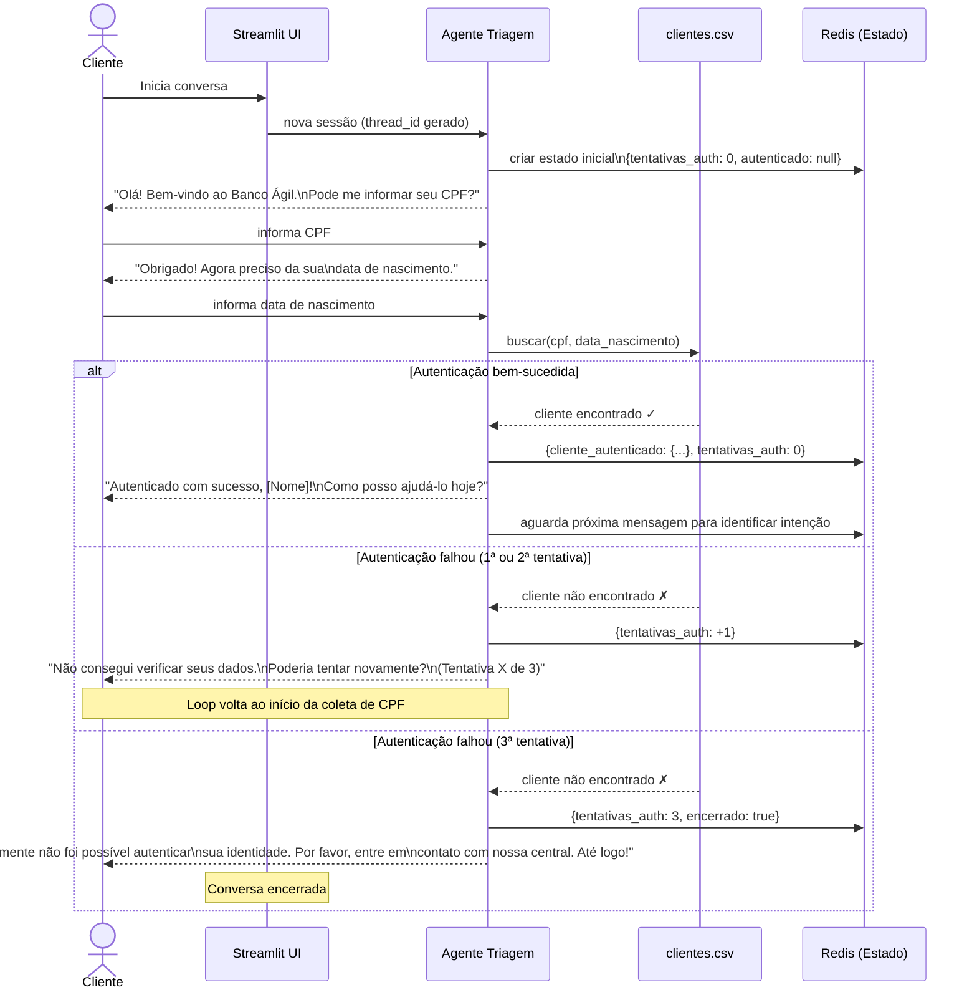
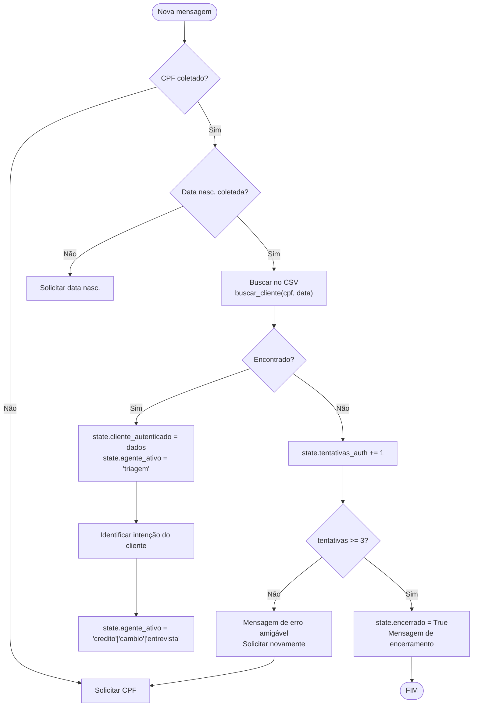

# Fluxo: Autenticação do Cliente (Agente de Triagem)

**Data:** 2026-04-22  
**Versão:** 1.0  
**Referências:** [ADR-003](../decisions/ADR-003-handoff-agentes.md) · [ADR-004](../decisions/ADR-004-persistencia-estado.md)

---

## Sequência de autenticação

---

## Fluxo de decisão (visão do código)

---

## Edge cases cobertos

| Cenário | Comportamento esperado |
|---------|----------------------|
| CPF com ou sem máscara (`123.456.789-00` vs `12345678900`) | Normalizar antes de comparar |
| Data em formatos diferentes (`01/01/1990` vs `1990-01-01`) | Normalizar para ISO antes de comparar |
| Cliente digita texto no lugar do CPF | Agente solicita novamente com orientação |
| Usuário pede para encerrar durante autenticação | `encerrado = True` imediato |
| CSV vazio ou corrompido | Mensagem de erro técnico + log, não expõe detalhes ao cliente |
