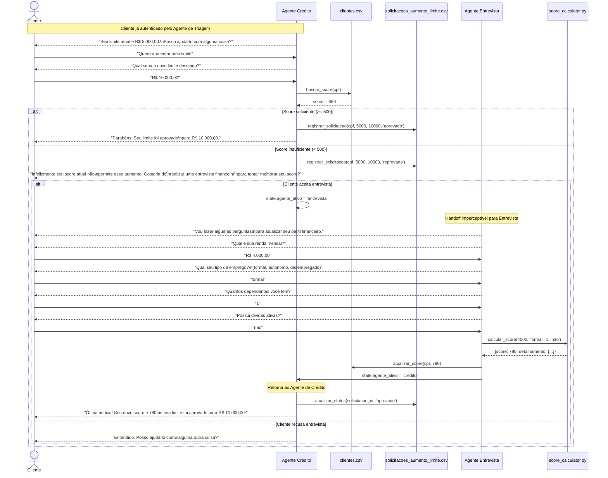
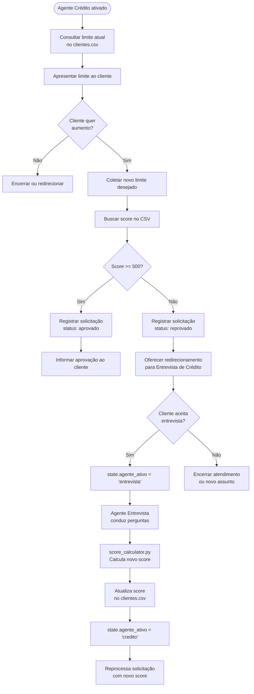

# Fluxo: Crédito e Entrevista de Crédito

**Data:** 2026-04-22  
**Versão:** 1.0  
**Referências:** [ADR-005](../decisions/ADR-005-calculo-score.md) · [ADR-003](../decisions/ADR-003-handoff-agentes.md)

---

## Sequência: Solicitação de Aumento de Limite



---

## Fluxo de decisão do score



---

## Fórmula de score (referência rápida)

Conforme especificado no case e documentado no [ADR-005](../decisions/ADR-005-calculo-score.md):

```
score = peso_renda + peso_emprego + peso_dependentes + peso_dividas

Onde:
  peso_renda       = min(renda_mensal / 1000 * 30, 900)
  peso_emprego     = formal→300 | autônomo→200 | desempregado→0
  peso_dependentes = 0→100 | 1→80 | 2→60 | 3+→30
  peso_dividas     = sim→-100 | não→100

Limiar de aprovação: score >= 500
```

---

## Edge cases cobertos

| Cenário | Comportamento esperado |
|---------|----------------------|
| Cliente já tem o maior limite possível | Agente informa e encerra educadamente |
| Novo limite menor que o atual | Agente questiona e confirma antes de registrar |
| Erro ao escrever no CSV | Log técnico, mensagem amigável ao cliente |
| Cliente pede entrevista sem solicitação prévia | Agente aceita e conduz diretamente |
| Score após entrevista ainda insuficiente | Informar honestamente, sem loop infinito |
