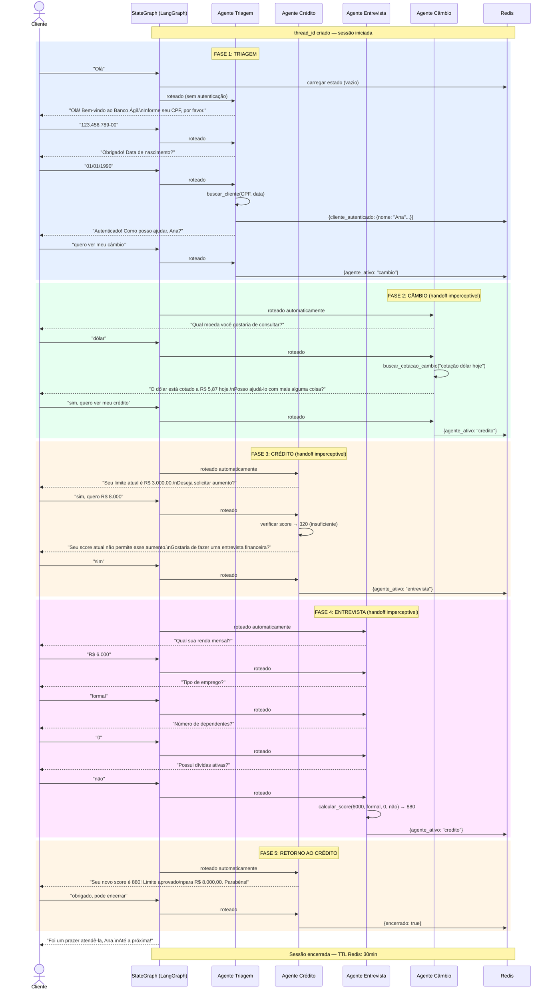
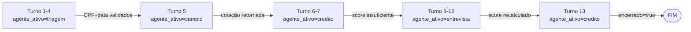

# Fluxo: Handoff Completo entre Agentes

**Data:** 2026-04-22  
**Versão:** 1.0  
**Referências:** [ADR-003](../decisions/ADR-003-handoff-agentes.md) · [ADR-001](../decisions/ADR-001-framework-agentes.md)

---

## Visão geral de uma sessão completa

Este fluxo documenta uma sessão real cobrindo todos os agentes — da entrada até o encerramento — para ilustrar como o handoff implícito funciona na prática.



---

## O que o cliente experimenta

Do ponto de vista do cliente, a conversa foi com **um único atendente** que:
1. Consultou câmbio
2. Consultou crédito
3. Fez uma entrevista
4. Voltou ao crédito e aprovou o aumento

Nenhuma mensagem de "transferência", nenhuma reautenticação, nenhuma quebra de contexto.

---

## O que acontece por baixo dos panos



Cada seta representa uma atualização silenciosa no `BancoAgilState` do Redis. O cliente não vê nenhuma dessas transições.

---

## Encerramento de conversa

Qualquer agente pode encerrar a conversa a qualquer momento:

```python
# Em qualquer nó do grafo
if detectar_intencao_encerramento(mensagem):
    return {"encerrado": True}
# O router lê encerrado=True e retorna END
```

Frases que devem acionar encerramento:
- "encerrar", "fechar", "sair", "tchau", "obrigado, até logo", "não preciso de mais nada"
