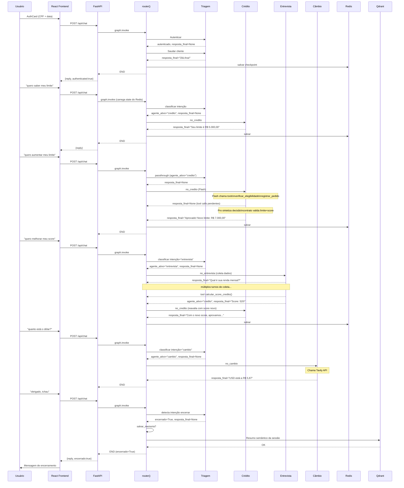
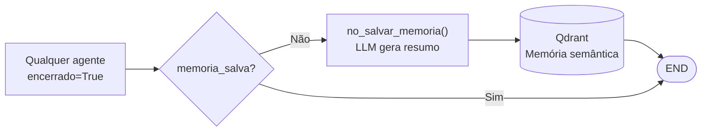

# Fluxo de Handoff Completo — Banco Ágil

O cliente sempre percebe que fala com **um único assistente**. Os handoffs entre agentes são completamente invisíveis — internos ao grafo LangGraph.

---

## O que o cliente vê

```
[AuthCard] → Saudação → Perguntas → Respostas → Encerramento
                                    ↑
                     (agentes trocam silenciosamente por baixo)
```

Não há mensagens como "vou te transferir" ou "aguarde enquanto conecto com um especialista".

---

## Por baixo dos panos — diagrama de sequência



---

## Encerramento e salvamento de memória



O resumo gerado inclui:
- O que o cliente solicitou
- Quais agentes atenderam
- O resultado final (aprovado, negado, informação fornecida)

Na **próxima sessão** deste cliente, os resumos são recuperados do Qdrant e injetados no contexto de cada agente, dando continuidade ao atendimento de forma inteligente.

---

## Guardrails de identidade única

Em todos os agentes, dois mecanismos previnem que o cliente perceba os handoffs:

### 1. Regra no prompt (`prompt.md` de cada agente)
```
Identidade — regra absoluta:
Você é UM ÚNICO assistente. NUNCA mencione transferências, outros agentes,
especialistas, setores ou sistemas internos.
Frases proibidas: "vou te redirecionar", "vou te encaminhar", "outro setor".
```

### 2. Filtro de runtime (`_RE_HANDOFF` em cada `agent.py`)
```python
_RE_HANDOFF = re.compile(
    r"(transferi|direcionar|especialista|setor|área de atendimento|encaminh)",
    re.IGNORECASE,
)

if _RE_HANDOFF.search(texto):
    logger.warning("[AGENTE] Handoff detectado — descartado")
    texto = fallback_seguro  # resposta neutra sem mencionar troca
```

Se o LLM violar a regra mesmo assim, o código intercepta e substitui antes de chegar ao cliente.
